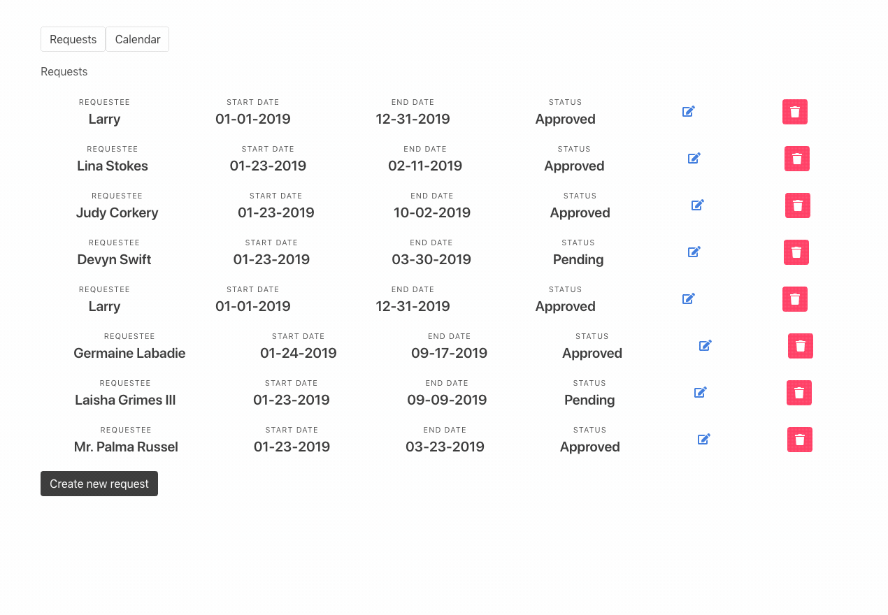

# Vacation Tracker

This is application designed for a company to track and plan for vacation time of their employees.

### Demo


### Tech stack

- React
- Reach Router
- BigTest
- Mirage (for test/development mock data)
- Bulma CSS

This project was done as a learning exercise and as such was left intentionally light on detail.
Some things excluded from the scope were:

- form validation
- loading states
- user authentification
- a live backend
- better looking styles

### Setting up for development

We prefer using Yarn for package management, but of course NPM commands work great as well.

#### Install dependencies first
```
yarn
```

#### Starting up the development server
```
yarn start
```

#### Running the test suite
```
yarn test
```
